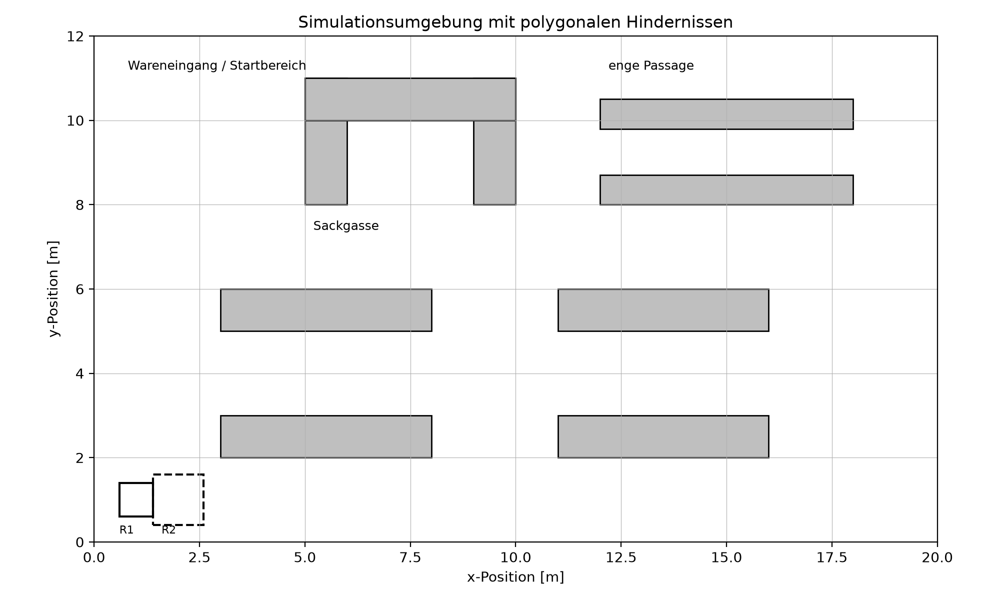
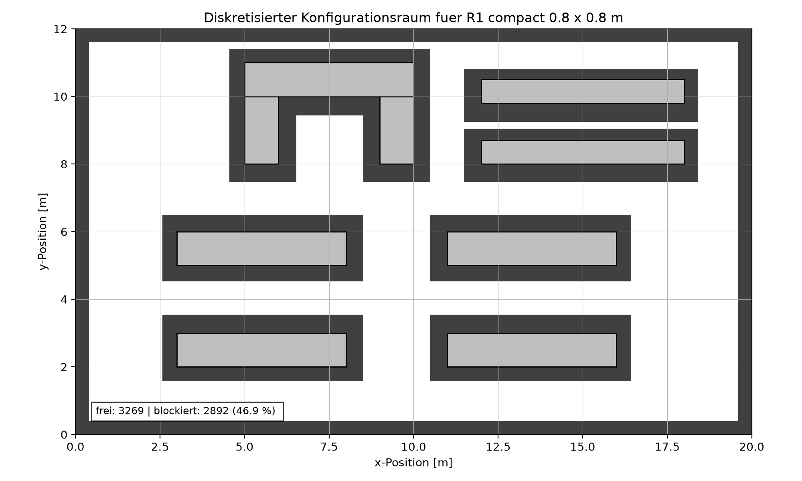
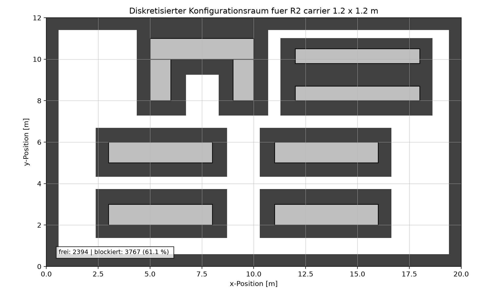
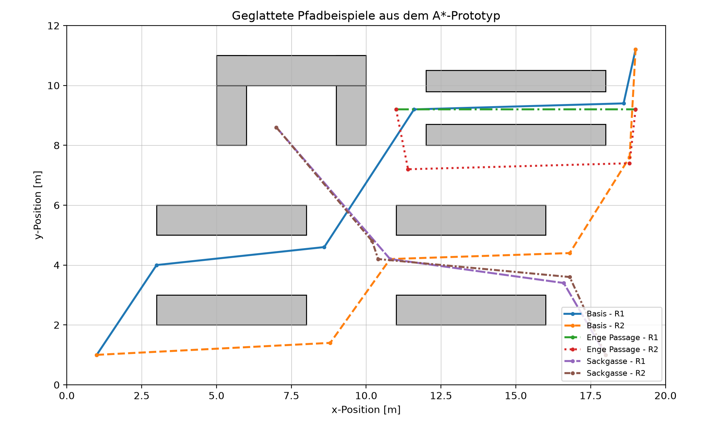
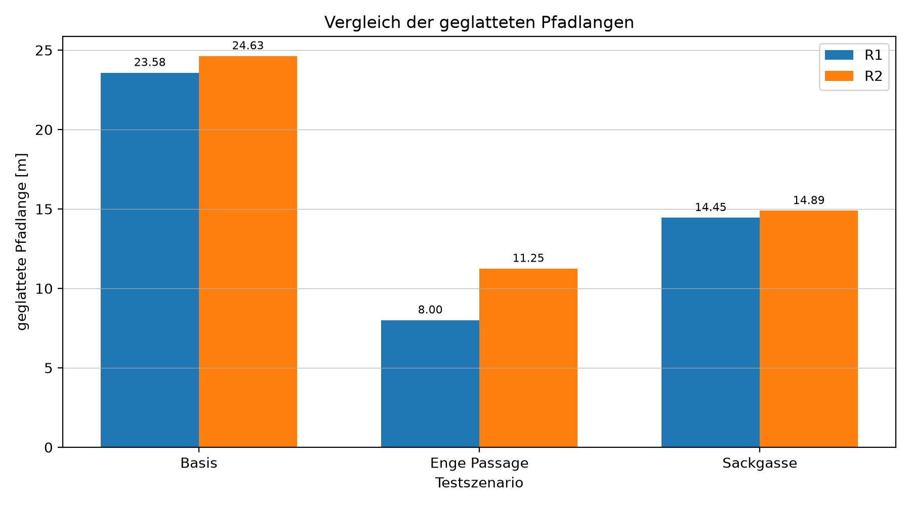

# AMR Path Planning Prototype

Dieses Repository enthält einen Python-Prototyp zur Pfadplanung für automatisierte mobile Roboter (AMR) in einer künstlichen Lagerumgebung.  
Der Prototyp wurde im Rahmen einer Fallstudie im Kurs **Mobile Robotik** entwickelt und dient als nachvollziehbarer Machbarkeitsnachweis für eine geometrische Wegplanung in einem zweidimensionalen Lagerlayout.

Der Roboter wird in dieser Version als **omnidirektional** angenommen. Dadurch besteht eine Konfiguration nur aus der Position des Roboterreferenzpunkts:

```text
q = (x, y)
```

Die Orientierung des Roboters wird in dieser ersten Entwicklungsphase konstant gehalten. Der Fokus liegt damit auf der geometrischen Pfadplanung, der Diskretisierung des Konfigurationsraums und der Suche nach kollisionsfreien Wegen.

---

## Ziel des Projekts

Das Ziel des Programms ist es, für automatisierte mobile Roboter einen kollisionsfreien Pfad von einem Startpunkt zu einem Zielpunkt innerhalb einer Lagerumgebung zu berechnen.

Die Lagerumgebung und die Robotergeometrie werden polygonal modelliert. Anschließend wird der freie Konfigurationsraum über ein regelmäßiges Raster angenähert. Auf diesem Raster sucht der A*-Algorithmus einen Pfad, der anschließend geglättet und visualisiert wird.

Der Prototyp zeigt insbesondere, wie sich unterschiedliche Robotergeometrien auf die Nutzbarkeit eines Lagerlayouts auswirken. Dazu werden zwei Robotergrößen miteinander verglichen.

---

## Was macht der Code?

Das Hauptskript `path_planning_amr_v2.py` führt folgende Schritte aus:

1. Es erstellt eine künstliche Lagerumgebung mit mehreren polygonalen Hindernissen.
2. Es definiert zwei unterschiedliche Roboter-Footprints.
3. Es diskretisiert den zweidimensionalen Konfigurationsraum mit einer Rasterauflösung von 0,20 m.
4. Es prüft für jeden Rasterpunkt, ob der Roboter an dieser Position kollisionsfrei stehen könnte.
5. Es verwendet A*, um auf dem freien Rastergraphen einen Pfad von Start zu Ziel zu finden.
6. Es glättet den gefundenen Rohpfad durch eine Sichtlinienprüfung.
7. Es berechnet Kennzahlen wie Pfadlänge, Anzahl der Pfadpunkte und expandierte Suchknoten.
8. Es schreibt die Ergebnisse in `path_planning_results.json`.
9. Es erzeugt mehrere Abbildungen im Ordner `figures_amr/`.

---

## Installation und Ausführung

Das Programm kann unter **macOS**, **Linux** und **Windows** ausgeführt werden. Voraussetzung ist eine installierte Python-3-Version.

---

### Repository herunterladen

```bash
git clone https://github.com/Kilian3000/-amr-path-planning-Fallstudie.git
cd -amr-path-planning-Fallstudie
```

Wenn das Repository bereits lokal vorhanden ist, reicht es, direkt in den Projektordner zu wechseln.

---

### macOS / Linux

Die folgenden Befehle werden im Terminal im Repository-Ordner ausgeführt.

#### 1. Virtuelle Python-Umgebung erstellen

```bash
python3 -m venv .venv
```

#### 2. Virtuelle Umgebung aktivieren

```bash
source .venv/bin/activate
```

Nach der Aktivierung steht im Terminal normalerweise `(.venv)` am Zeilenanfang.

#### 3. Abhängigkeiten installieren

```bash
python3 -m pip install -r requirements.txt
```

#### 4. Simulation ausführen

```bash
python3 path_planning_amr_v2.py
```

---

### Windows

Unter Windows können die Befehle in **PowerShell** oder im **Windows Terminal** ausgeführt werden.

#### 1. Virtuelle Python-Umgebung erstellen

```powershell
py -m venv .venv
```

#### 2. Virtuelle Umgebung aktivieren

```powershell
.\.venv\Scripts\Activate.ps1
```

Falls PowerShell das Aktivieren blockiert, kann für die aktuelle Sitzung diese Richtlinie gesetzt werden:

```powershell
Set-ExecutionPolicy -Scope Process -ExecutionPolicy Bypass
```

Danach den Aktivierungsbefehl erneut ausführen:

```powershell
.\.venv\Scripts\Activate.ps1
```

#### 3. Abhängigkeiten installieren

```powershell
py -m pip install -r requirements.txt
```

#### 4. Simulation ausführen

```powershell
py path_planning_amr_v2.py
```

---

### Erwartete Ausgabe

Nach erfolgreicher Ausführung erscheinen im Terminal die berechneten Kennzahlen zu Konfigurationsraum und Pfadplanung.

Außerdem werden die Ergebnisdatei und die Abbildungen erzeugt beziehungsweise aktualisiert:

```text
path_planning_results.json
figures_amr/*.png
```

Wenn alles korrekt läuft, haben alle sechs Testläufe den Status `ok`.

Die Ausgabe enthält unter anderem folgende Szenarien:

```text
Basis
Enge Passage
Sackgasse
```

jeweils für beide Robotergeometrien:

```text
R1 compact 0.8 x 0.8 m
R2 carrier 1.2 x 1.2 m
```

Für die Erzeugung der Diagramme wird `matplotlib` benötigt. Ohne `matplotlib` läuft die Pfadplanung zwar trotzdem, die Bilder werden dann jedoch nicht neu erzeugt.

---

## Simulationsumgebung

Die simulierte Lagerumgebung ist 20 m × 12 m groß. Sie enthält mehrere polygonale Hindernisse, die typische Lagerstrukturen wie Regale, Sperrbereiche, eine enge Passage und eine Sackgasse darstellen.



Die Umgebung wurde bewusst so aufgebaut, dass der Algorithmus nicht nur einen einfachen freien Raum durchfahren muss. Stattdessen enthält sie kritische Bereiche, an denen sichtbar wird, ob die Pfadplanung geometrisch sinnvoll arbeitet.

---

## Robotergeometrien

Es werden zwei verschiedene Roboter-Footprints getestet:

| Roboter | Beschreibung | Größe |
|---|---|---:|
| R1 | Kompakter AMR | 0,8 m × 0,8 m |
| R2 | Größerer Lastträger | 1,2 m × 1,2 m |

Beide Roboter werden als polygonale Footprints modelliert. Der Roboterreferenzpunkt liegt jeweils im Mittelpunkt des Footprints.

Die größere Robotergeometrie führt dazu, dass mehr Positionen im Konfigurationsraum blockiert werden. Das bedeutet: Ein größerer Roboter kann zwar mehr Last transportieren, verliert aber Bewegungsfreiheit in engen Bereichen des Lagers.

---

## Konfigurationsraum

Der Konfigurationsraum beschreibt, an welchen Positionen sich der Roboterreferenzpunkt befinden darf, ohne dass der Roboter mit Hindernissen oder der Lagergrenze kollidiert.

Für jeden Rasterpunkt wird der Roboterfootprint an diese Position verschoben und anschließend auf Kollisionen geprüft. Dadurch entstehen freie und blockierte Rasterpunkte.

### Konfigurationsraum für R1



### Konfigurationsraum für R2



Die Ergebnisse zeigen, dass der größere Roboter deutlich weniger freien Konfigurationsraum besitzt.

| Roboter | Rasterpunkte gesamt | Frei | Blockiert | Blockiert |
|---|---:|---:|---:|---:|
| R1: 0,8 m × 0,8 m | 6161 | 3269 | 2892 | 46,9 % |
| R2: 1,2 m × 1,2 m | 6161 | 2394 | 3767 | 61,1 % |

---

## Pfadplanung mit A*

Die Pfadplanung erfolgt auf einem Acht-Nachbar-Raster. Jeder freie Rasterpunkt ist ein möglicher Suchknoten. Von einem Knoten aus können horizontale, vertikale und diagonale Nachbarn erreicht werden, sofern diese kollisionsfrei sind.

A* bewertet jeden Knoten über:

```text
f(n) = g(n) + h(n)
```

Dabei ist:

- `g(n)` die bisherige Pfadkosten vom Start bis zum aktuellen Knoten
- `h(n)` die geschätzte Restdistanz bis zum Ziel
- `f(n)` die Gesamtbewertung für die Priorisierung der Suche

Als Heuristik wird die euklidische Distanz zum Ziel verwendet.

Nach der Suche wird der Rohpfad geglättet. Dabei werden unnötige Zwischenpunkte entfernt, solange die direkte Verbindung zwischen zwei Pfadpunkten kollisionsfrei bleibt.

---

## Testszenarien

Der Prototyp enthält drei Testszenarien:

### 1. Basisfall

Der Roboter fährt durch das Lager von einem Startbereich zu einem Zielpunkt.  
Dieses Szenario prüft die allgemeine Funktionsfähigkeit des Planers.

### 2. Enge Passage

Der Roboter muss einen schmalen Durchgang im oberen rechten Bereich des Lagers nutzen oder umgehen.  
Dieses Szenario zeigt besonders gut den Unterschied zwischen den beiden Robotergeometrien.

### 3. Sackgasse

Der Roboter startet in einem U-förmigen Bereich und muss einen Weg nach draußen finden.  
Dieses Szenario demonstriert, dass der A*-Planer nicht wie einfache Potentialfeldverfahren in einer Sackgasse stecken bleibt.

---

## Erzeugte Pfade

Die folgende Abbildung zeigt die geglätteten Pfade für die drei Szenarien und beide Robotergeometrien.



Der kleinere Roboter R1 kann im Szenario „Enge Passage“ direkt durch den schmalen Bereich fahren. Der größere Roboter R2 muss dagegen einen Umweg planen, weil sein Footprint in der Passage nicht kollisionsfrei hineinpasst.

---

## Ergebnisübersicht

Alle sechs Testläufe liefern einen gültigen Pfad mit Status `ok`.

| Szenario | Roboter | Rohpfad | Geglätteter Pfad | Rohknoten | Expandierte Knoten |
|---|---|---:|---:|---:|---:|
| Basis | R1 | 24,57 m | 23,58 m | 111 | 2051 |
| Basis | R2 | 25,39 m | 24,63 m | 118 | 1650 |
| Enge Passage | R1 | 8,00 m | 8,00 m | 41 | 40 |
| Enge Passage | R2 | 11,53 m | 11,25 m | 57 | 279 |
| Sackgasse | R1 | 15,09 m | 14,45 m | 64 | 671 |
| Sackgasse | R2 | 15,55 m | 14,89 m | 68 | 542 |

Die folgende Abbildung vergleicht die geglätteten Pfadlängen der beiden Roboter.



Besonders auffällig ist der Unterschied bei der engen Passage. Dort steigt die geglättete Pfadlänge von 8,00 m auf 11,25 m. Das zeigt, dass nicht nur die globale Lagergröße, sondern vor allem lokale Engstellen für die Wahl der Robotergeometrie entscheidend sind.

---

## Grenzen des Prototyps

Der Prototyp ist bewusst einfach gehalten und dient als Machbarkeitsnachweis. Er ist kein vollständiges Navigationssystem für reale AMR.

In dieser Version werden nicht modelliert:

- dynamische Hindernisse
- bewegte Personen
- mehrere Roboter gleichzeitig
- Sensordaten
- Lokalisierungsunsicherheit
- zeitparametrierte Trajektorien
- Geschwindigkeit, Beschleunigung und Bremsprofile
- aktive Rotation des Roboterfootprints

Für einen industriellen Einsatz müsste dieser geometrische Planer daher mit lokalen Ausweichstrategien, Sicherheitsfunktionen, Sensorik, Trajektorienplanung und Flottenkoordination kombiniert werden.

---

## Geplante erweiterte Version

Nach dieser Basisversion soll eine erweiterte Version ergänzt werden, bei der wichtige Parameter direkt am Anfang des Codes angepasst werden können.

Geplant ist ein klarer Konfigurationsbereich im Python-Skript, zum Beispiel:

```python
ROBOT_WIDTH = 0.8
ROBOT_HEIGHT = 0.8
WAREHOUSE_WIDTH = 20.0
WAREHOUSE_HEIGHT = 12.0
RESOLUTION = 0.20
```

Damit sollen Nutzerinnen und Nutzer einfacher eigene Testfälle ausprobieren können, ohne die eigentliche Implementierung der Kollisionsprüfung oder A*-Suche bearbeiten zu müssen.

Geplant sind insbesondere:

- einfache Änderung der Robotergröße
- optionale Definition eigener polygonaler Roboter-Footprints
- Anpassung der Lagergröße
- Anpassung der Hindernisse im Lagerlayout
- Änderung von Start- und Zielpunkten
- Änderung der Rasterauflösung

Die Anpassung der Robotergröße ist technisch einfach umzusetzen. Auch die Änderung der Lagergeometrie ist möglich, solange die Hindernisse als einfache, geordnete Polygone definiert werden. Für die nächste Version soll diese Anpassbarkeit übersichtlicher dokumentiert und im Code klarer getrennt werden.

---

## Einordnung

Dieses Repository enthält den Quellcode und die erzeugten Simulationsergebnisse zur Fallstudie.  
Der Code ist als nachvollziehbarer Softwareprototyp gedacht und zeigt den geometrischen Kern einer gridbasierten AMR-Pfadplanung mit A*.